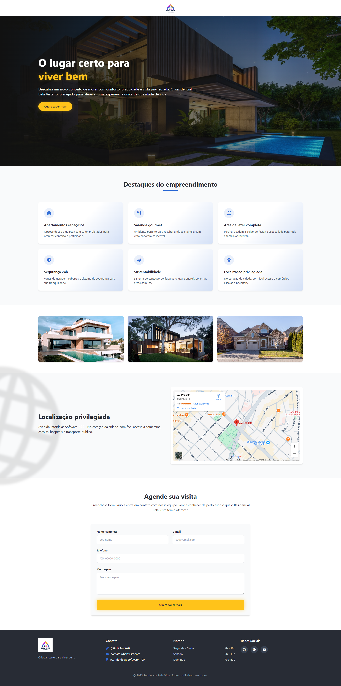

# Teste Prático – Fase 2: Web Designer

Este repositório contém os arquivos referentes ao teste prático da Fase 2, composto por dois exercícios:

---

## Exercício 1 – Análise e Redesenho de Pop-up

### Análise crítica do pop-up original
O pop-up original apresenta boa estrutura básica, porém identifiquei algumas oportunidades de melhoria, como:

- Texto pouco destacado devido ao baixo contraste com o plano de fundo.
- Hierarquia visual pouco clara, dificultando o foco nas informações principais.
- Design robusto/bruto e pouco interativo
- O botão de ação possui muito pouco destaque, o que pode prejudicar a conversão e até a leitura deivdo a escolhad e cores do texto e do fundo do botão.
- Melhorei o design dos dots e botes de navegação, deixando-os mais modernos

### Justificativa para o redesenho
Optei por redesenhar o pop-up para melhorar a legibilidade, fortalecer a hierarquia das informações e dar maior destaque ao botão de CTA, sem modificar o plano de fundo conforme as orientações.

### Escolhas aplicadas no novo layout
- Aumentei o contraste do texto, usando cores mais visíveis.
- Reorganizei o posicionamento para alinhar os elementos a esquerda e melhorar o equilíbrio visual.
- Destaquei o botão com cores mais vibrantes e pensando em cores mais quentes como laranja, vermelho e amarelo para chamar atenção.
- Adicionei um pequeno efeito de desfoque ao fundo com blur e diminui o brilho pra aumentar mais o fofo e contraste visual ao pop-up
- Mantive o conteúdo original intacto, conforme solicitado.

### Pop-up redesenhado

---

## Exercício 2 – Layout Visual da Landing Page

### Escolhas de layout e organização
- Dividi a página em seções claras: cabeçalho, hero, destaques, galeria, localização, contato e rodapé.
- Usei uma paleta de cores alinhada com a identidade visual do Residencial Bela Vista, priorizando legibilidade e harmonia.
- Incluí o formulário de contato com todos os campos solicitados e um botão CTA destacado.
- Posicionei os ícones das redes sociais no rodapé para melhor visibilidade e usabilidade.
- Priorizei um design limpo e moderno, garantindo fácil navegação e leitura.

### Layout final da Landing Page

---

## Considerações finais

O projeto foi desenvolvido respeitando todos os requisitos técnicos e visuais do teste, buscando demonstrar organização, bom gosto visual e capacidade de tomada de decisão alinhada ao briefing.

---

Obrigado pela oportunidade!

